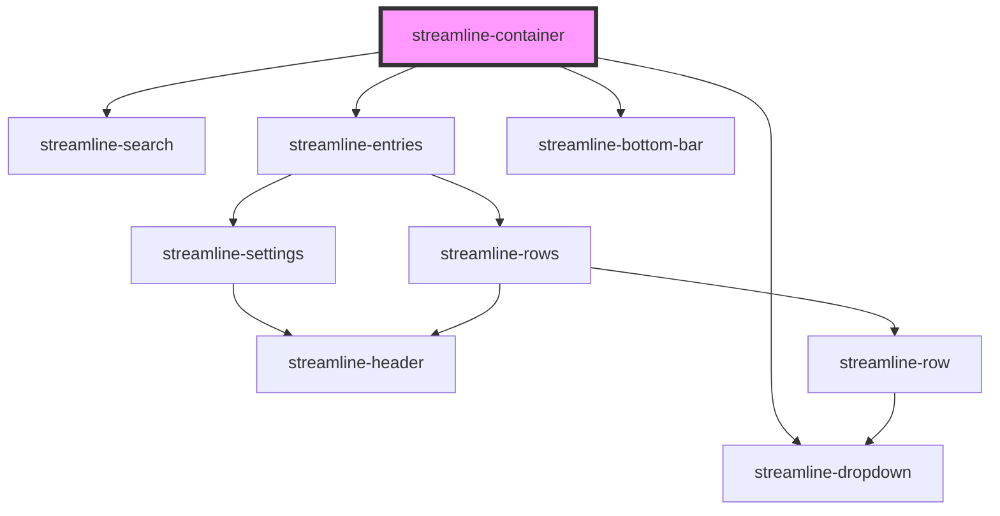

# streamline-container

<!-- Auto Generated Below -->

## Properties

| Property | Attribute | Description | Type      | Default     |
| -------- | --------- | ----------- | --------- | ----------- |
| `active` | `active`  |             | `""`      | `undefined` |
| `test`   | `test`    |             | `boolean` | `undefined` |

## Methods

### `toggle() => Promise<void>`

#### Returns

Type: `Promise<void>`

## Dependencies

### Depends on

- [streamline-search](../search)
- [streamline-dropdown](../dropdown)
- [streamline-entries](../entries)
- [streamline-bottom-bar](../bottom-bar)

### Graph

----------------------------------------------

*Built with [StencilJS](https://stenciljs.com/)*
