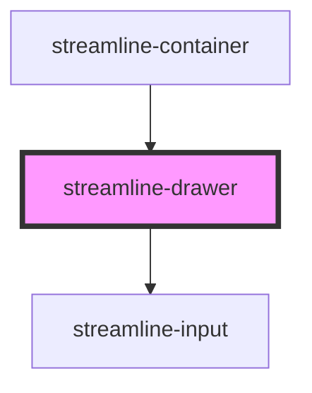

# streamline-drawer

<!-- Auto Generated Below -->

## Overview

Drawer.

## Dependencies

### Used by

 - [streamline-container](../container)

### Depends on

- [streamline-input](../input)

### Graph

----------------------------------------------

*Built with [StencilJS](https://stenciljs.com/)*
