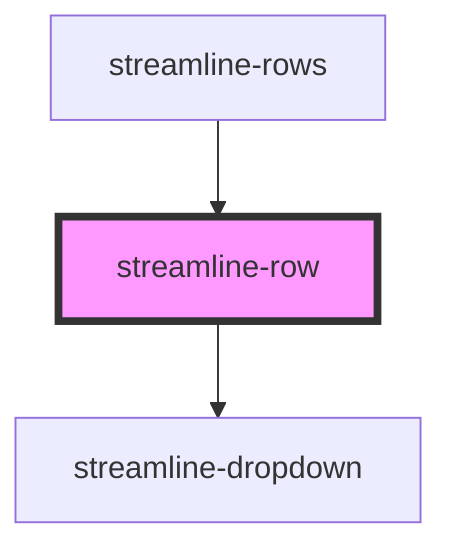

# streamline-row

<!-- Auto Generated Below -->

## Properties

| Property        | Attribute         | Description | Type      | Default     |
| --------------- | ----------------- | ----------- | --------- | ----------- |
| `disabled`      | `disabled`        |             | `boolean` | `false`     |
| `isCurrentSite` | `is-current-site` |             | `boolean` | `false`     |
| `isEdit`        | `is-edit`         |             | `boolean` | `false`     |
| `isFav`         | `is-fav`          |             | `boolean` | `false`     |
| `isFocus`       | `is-focus`        |             | `boolean` | `false`     |
| `item`          | `item`            |             | `any`     | `undefined` |
| `mb`            | `mb`              |             | `any`     | `undefined` |

## Dependencies

### Used by

 - [streamline-rows](../rows)

### Depends on

- [streamline-dropdown](../dropdown)

### Graph

----------------------------------------------

*Built with [StencilJS](https://stenciljs.com/)*
