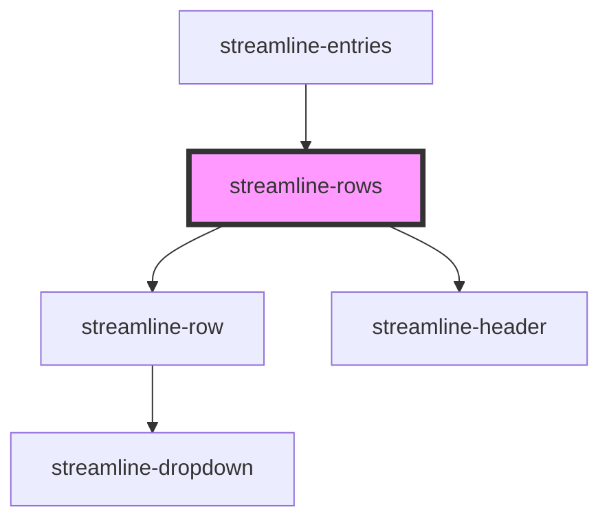

# streamline-rows

<!-- Auto Generated Below -->

## Dependencies

### Used by

 - [streamline-entries](../entries)

### Depends on

- [streamline-row](../row)
- [streamline-header](../header)

### Graph

----------------------------------------------

*Built with [StencilJS](https://stenciljs.com/)*
