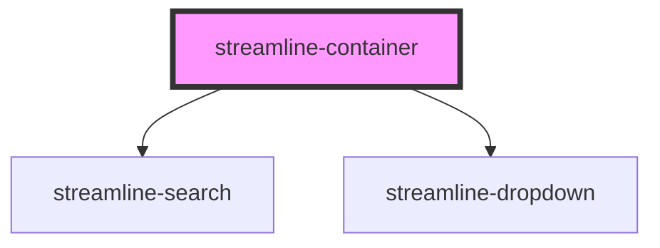

# streamline-container

<!-- Auto Generated Below -->

## Properties

| Property  | Attribute | Description | Type      | Default     |
| --------- | --------- | ----------- | --------- | ----------- |
| `visible` | `visible` |             | `boolean` | `undefined` |

## Dependencies

### Depends on

- [streamline-search](../search)
- [streamline-dropdown](../dropdown)

### Graph

----------------------------------------------

*Built with [StencilJS](https://stenciljs.com/)*
