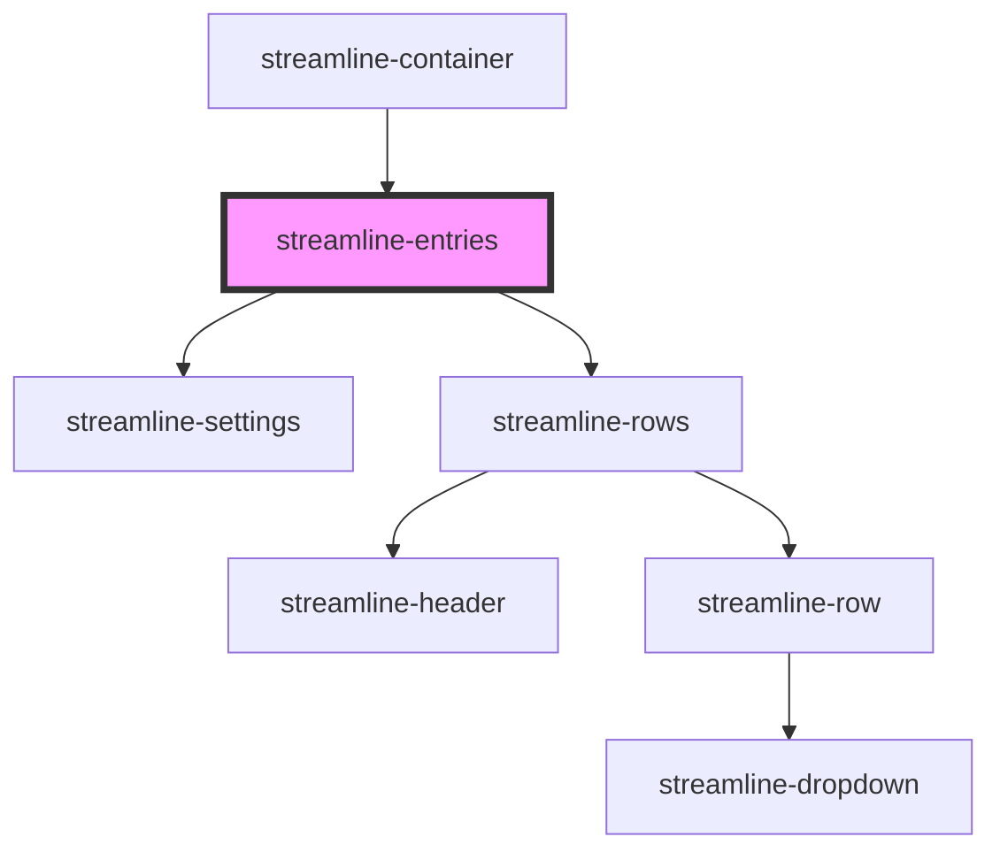

# streamline-entries

<!-- Auto Generated Below -->

## Dependencies

### Used by

 - [streamline-container](../container)

### Depends on

- [streamline-settings](../settings)
- [streamline-rows](../rows)

### Graph

----------------------------------------------

*Built with [StencilJS](https://stenciljs.com/)*
