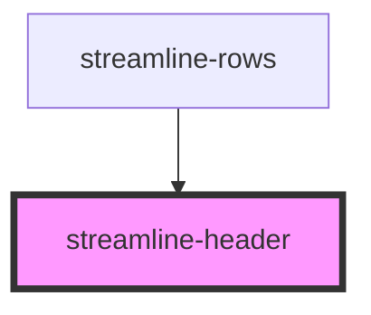

# streamline-header

<!-- Auto Generated Below -->

## Properties

| Property | Attribute | Description | Type  | Default     |
| -------- | --------- | ----------- | ----- | ----------- |
| `item`   | `item`    |             | `any` | `undefined` |
| `mb`     | `mb`      |             | `any` | `undefined` |

## Dependencies

### Used by

 - [streamline-rows](../rows)

### Graph

----------------------------------------------

*Built with [StencilJS](https://stenciljs.com/)*
