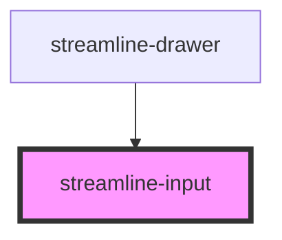

# streamline-input

<!-- Auto Generated Below -->

## Properties

| Property      | Attribute | Description | Type       | Default     |
| ------------- | --------- | ----------- | ---------- | ----------- |
| `handleInput` | --        |             | `Function` | `undefined` |
| `invalid`     | `invalid` |             | `boolean`  | `undefined` |
| `label`       | `label`   |             | `string`   | `undefined` |
| `uid`         | `uid`     |             | `string`   | `undefined` |
| `value`       | `value`   |             | `string`   | `undefined` |

## Dependencies

### Used by

 - [streamline-drawer](../drawer)

### Graph

----------------------------------------------

*Built with [StencilJS](https://stenciljs.com/)*
