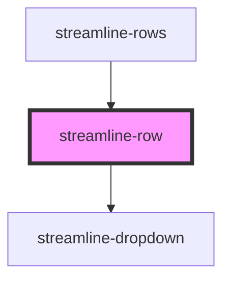

# streamline-row

<!-- Auto Generated Below -->

## Properties

| Property | Attribute | Description | Type                                                                                                                                                                                        | Default                                                                                                                                                                                     |
| -------- | --------- | ----------- | ------------------------------------------------------------------------------------------------------------------------------------------------------------------------------------------- | ------------------------------------------------------------------------------------------------------------------------------------------------------------------------------------------- |
| `item`   | --        |             | `{ ID: number; adminUrl: string; guid: string; href: string; hrefEdit: string; name: string; path: string; post_title: string; route: string; siteId: number; tab: string; type: string; }` | `{     ID: 1,     adminUrl: '',     guid: '',     href: '',     hrefEdit: '',     name: '',     path: '',     post_title: '',     route: '',     siteId: 1,     tab: '',     type: '',   }` |
| `mb`     | `mb`      |             | `any`                                                                                                                                                                                       | `undefined`                                                                                                                                                                                 |
| `table`  | `table`   |             | `any`                                                                                                                                                                                       | `undefined`                                                                                                                                                                                 |

## Dependencies

### Used by

 - [streamline-rows](../rows)

### Depends on

- [streamline-dropdown](../dropdown)

### Graph

----------------------------------------------

*Built with [StencilJS](https://stenciljs.com/)*
