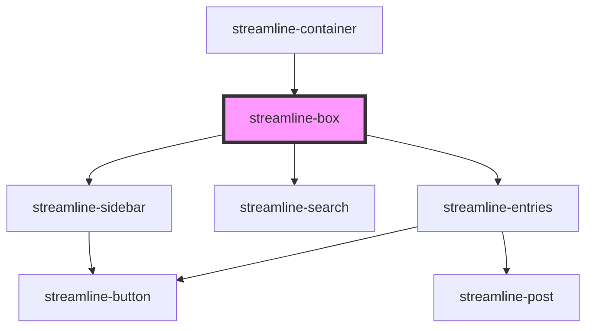

# streamline-box

<!-- Auto Generated Below -->

## Dependencies

### Used by

 - [streamline-container](../streamline-container)

### Depends on

- [streamline-sidebar](../streamline-sidebar)
- [streamline-search](../streamline-search)
- [streamline-entries](../streamline-entries)

### Graph

----------------------------------------------

*Built with [StencilJS](https://stenciljs.com/)*
