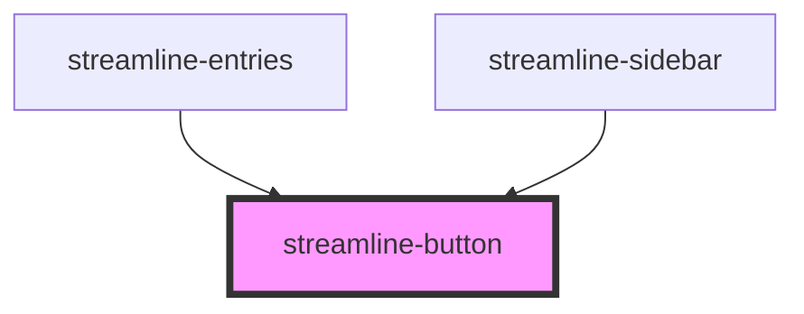

# streamline-button

<!-- Auto Generated Below -->

## Properties

| Property     | Attribute     | Description | Type      | Default     |
| ------------ | ------------- | ----------- | --------- | ----------- |
| `adminUrl`   | `admin-url`   |             | `string`  | `undefined` |
| `favourite`  | `favourite`   |             | `boolean` | `undefined` |
| `header`     | `header`      |             | `string`  | `undefined` |
| `href`       | `href`        |             | `string`  | `undefined` |
| `icon`       | `icon`        |             | `string`  | `undefined` |
| `index`      | `index`       |             | `number`  | `undefined` |
| `indexInner` | `index-inner` |             | `number`  | `undefined` |
| `indexSub`   | `index-sub`   |             | `number`  | `undefined` |
| `path`       | `path`        |             | `string`  | `undefined` |
| `siteId`     | `site-id`     |             | `number`  | `undefined` |
| `text`       | `text`        |             | `string`  | `undefined` |
| `type`       | `type`        |             | `string`  | `undefined` |
| `typeSub`    | `type-sub`    |             | `string`  | `undefined` |

## Dependencies

### Used by

 - [streamline-entries](../streamline-entries)
 - [streamline-sidebar](../streamline-sidebar)

### Graph

----------------------------------------------

*Built with [StencilJS](https://stenciljs.com/)*
