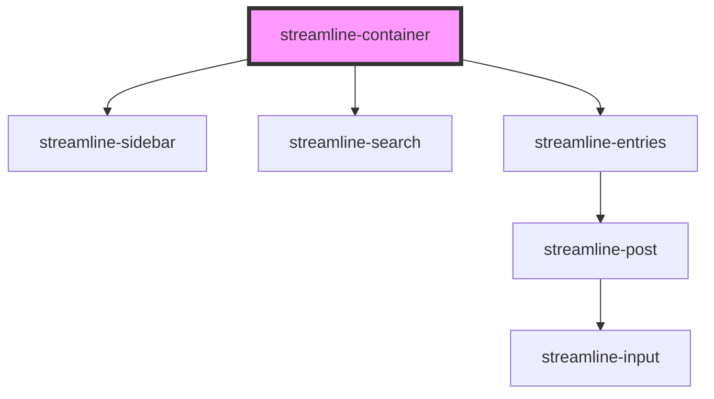

# streamline-container

<!-- Auto Generated Below -->

## Properties

| Property  | Attribute | Description | Type      | Default     |
| --------- | --------- | ----------- | --------- | ----------- |
| `mac`     | `mac`     |             | `boolean` | `false`     |
| `visible` | `visible` |             | `boolean` | `undefined` |

## Methods

### `toggle() => Promise<void>`

#### Returns

Type: `Promise<void>`

### `toggleTestFull(type: any) => Promise<void>`

#### Returns

Type: `Promise<void>`

## Dependencies

### Depends on

- [streamline-sidebar](../streamline-sidebar)
- [streamline-search](../streamline-search)
- [streamline-entries](../streamline-entries)

### Graph

----------------------------------------------

*Built with [StencilJS](https://stenciljs.com/)*
