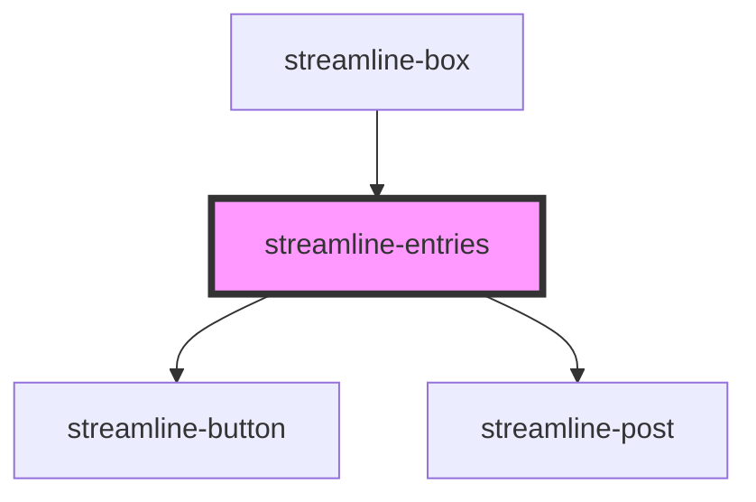

# streamline-entries

<!-- Auto Generated Below -->

## Dependencies

### Used by

 - [streamline-box](../streamline-box)

### Depends on

- [streamline-button](../streamline-button)
- [streamline-post](../streamline-post)

### Graph

----------------------------------------------

*Built with [StencilJS](https://stenciljs.com/)*
