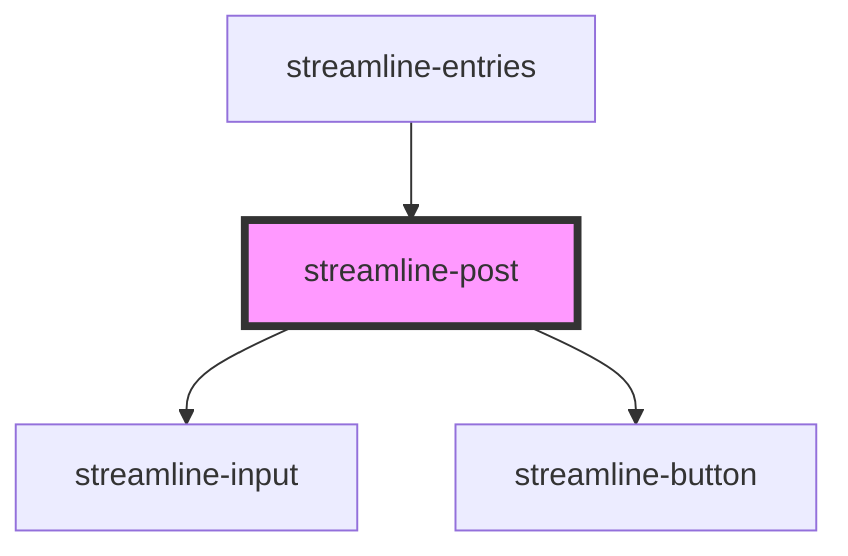

# streamline-post

<!-- Auto Generated Below -->

## Properties

| Property    | Attribute    | Description | Type      | Default     |
| ----------- | ------------ | ----------- | --------- | ----------- |
| `favourite` | `favourite`  |             | `boolean` | `undefined` |
| `hrefEdit`  | `href-edit`  |             | `string`  | `undefined` |
| `hrefView`  | `href-view`  |             | `string`  | `undefined` |
| `invalid`   | `invalid`    |             | `boolean` | `undefined` |
| `postId`    | `post-id`    |             | `number`  | `undefined` |
| `postSlug`  | `post-slug`  |             | `string`  | `undefined` |
| `postTitle` | `post-title` |             | `string`  | `undefined` |
| `postType`  | `post-type`  |             | `string`  | `undefined` |
| `siteId`    | `site-id`    |             | `number`  | `undefined` |

## Dependencies

### Used by

 - [streamline-entries](../streamline-entries)

### Depends on

- [streamline-input](../streamline-input)
- [streamline-button](../streamline-button)

### Graph

----------------------------------------------

*Built with [StencilJS](https://stenciljs.com/)*
